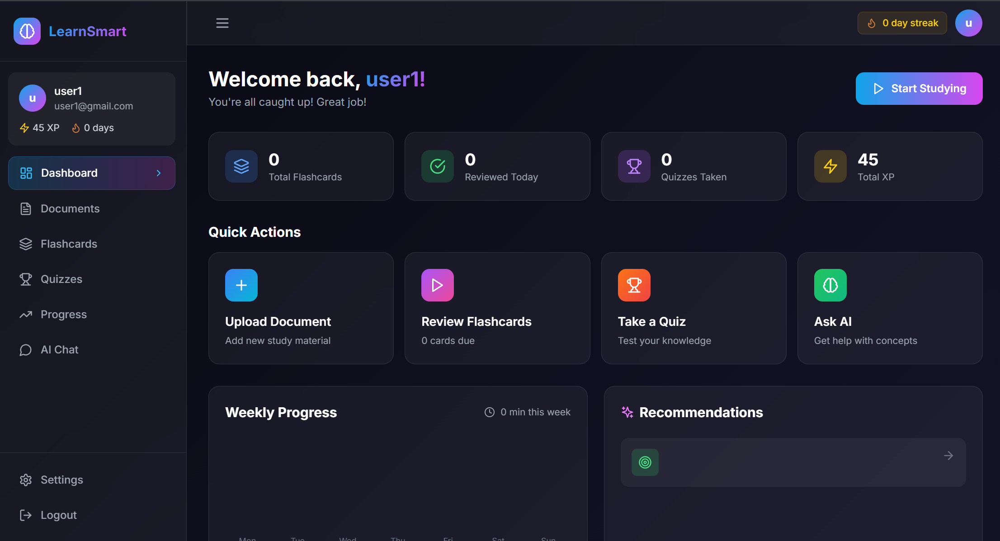
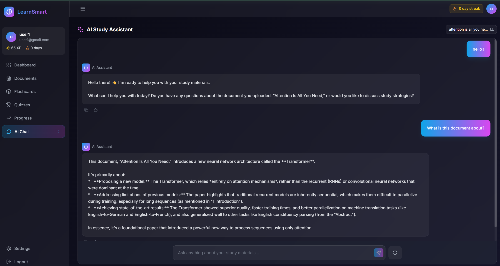
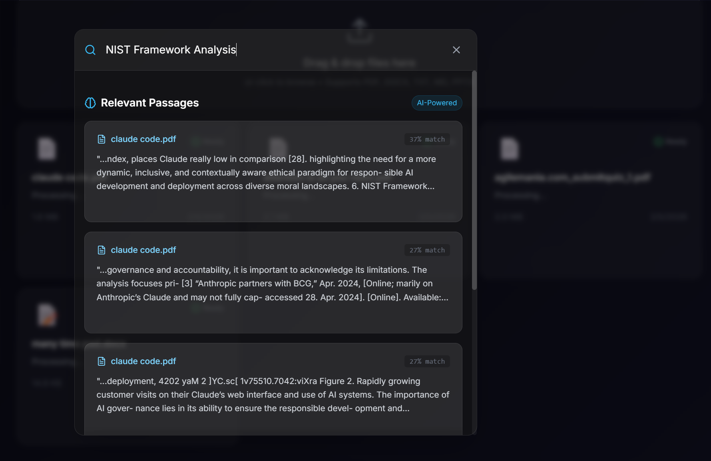
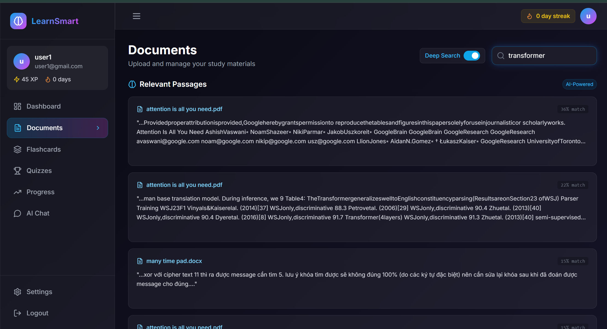
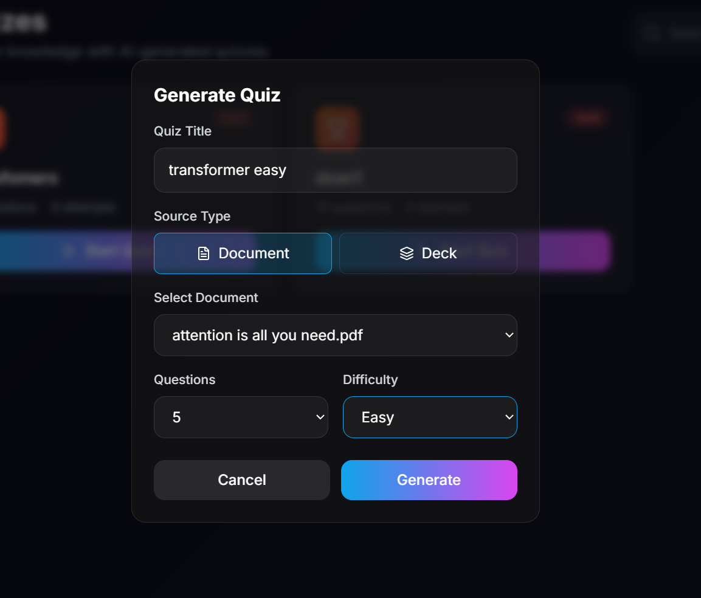
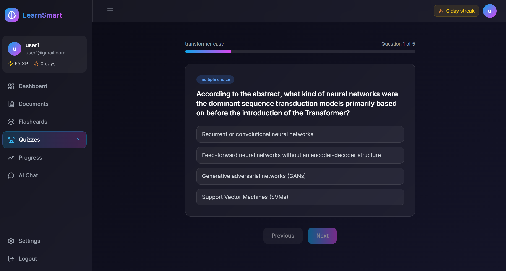

# 🧠 Smart Learning Companion

AI-powered personalized learning assistant with multi-agent orchestration, RAG-enabled chat, intelligent flashcards, and adaptive quizzes.


🌐 **Deployed on**: Google Cloud Run (`asia-southeast1`)

## 📸 Features in Action

### Dashboard Overview

*Track progress with XP, streaks, and quick actions for learning*

### AI Chat Assistant with RAG

*Context-aware conversation powered by Retrieval-Augmented Generation*

### Document Search with RAG


*Semantic search within a specific document with relevance scoring*


*Search across all uploaded documents with AI-powered context retrieval*

### Quiz Generation & Taking


*Create customized quizzes from documents or flashcard decks*


*Interactive quiz interface with multiple question types*

## ✨ Features

- **📄 Smart Document Processing** — Upload PDFs, DOCX, TXT, PPTX with automatic text extraction and summarization
- **🤖 Multi-Agent AI System** — Specialized agents (Chat, Explanation, Summary, Concept Extractor) working together
- **🔍 RAG-Powered Chat** — Retrieval-Augmented Generation with semantic search across your documents
- **⚡ Real-time Streaming** — Stream AI responses for instant feedback
- **🎴 AI Flashcard Generation** — Auto-generate flashcards from documents using LLM
- **🔄 Spaced Repetition** — SM-2 algorithm optimizes your review schedule for maximum retention
- **📝 Adaptive Quizzes** — Multiple question types (MCQ, True/False, Fill-in-blank) with difficulty adjustment
- **🔎 Semantic Document Search** — Find relevant information across all your study materials
- **📊 Progress Analytics** — Track streaks, XP, topic mastery, and study heatmap
- **🌙 Modern UI** — Glassmorphism design with smooth animations

## 🏗️ Tech Stack

### Backend
- **FastAPI** — High-performance async API
- **PostgreSQL** — Relational database with async SQLAlchemy
- **Elasticsearch** — Vector database & full-text search (BM25 + kNN hybrid)
- **LangChain** — LLM orchestration framework
- **SentenceTransformers** — Document embeddings (all-MiniLM-L6-v2)
- **LLM Support** — OpenAI (GPT-4o-mini) / Google (Gemini-2.5-flash)

### Frontend
- **Next.js 14** — React framework with App Router
- **TypeScript** — Type safety
- **Tailwind CSS** — Utility-first styling
- **Framer Motion** — Smooth animations
- **Zustand** — State management

## 🚀 Quick Start

```bash
# Clone & configure
git clone <repo-url>
cd learning_assistant
cp .env.example .env
# Edit .env with your API keys

# Start everything with Docker
docker-compose up -d
```

- **Frontend**: http://localhost:3000
- **Backend API**: http://localhost:8001
- **API Docs**: http://localhost:8001/docs

👉 See [Quick Start Guide](docs/QUICKSTART.md) for manual setup, environment variables, and Docker commands.

## 📁 Project Structure

```
learning_assistant/
├── backend/
│   ├── main.py              # FastAPI app entry
│   ├── config.py            # Settings management
│   ├── database/
│   │   ├── connection.py    # DB connection
│   │   ├── models.py        # SQLAlchemy models
│   │   └── schemas.py       # Pydantic schemas
│   ├── routers/
│   │   ├── auth.py          # Authentication
│   │   ├── documents.py     # Document management
│   │   ├── flashcards.py    # Flashcard CRUD & review
│   │   ├── quizzes.py       # Quiz generation & taking
│   │   ├── progress.py      # Progress tracking
│   │   └── chat.py          # AI chat & RAG
│   ├── services/
│   │   ├── ai_agents.py     # Multi-agent orchestrator
│   │   ├── document_processor.py
│   │   ├── flashcard_generator.py
│   │   ├── quiz_generator.py
│   │   └── spaced_repetition.py
│   └── utils/
│       ├── security.py      # JWT & password hashing
│       └── prompts.py       # LLM prompt templates
│
├── frontend/
│   ├── app/
│   │   ├── page.tsx         # Landing page
│   │   ├── login/           # Auth pages
│   │   ├── register/
│   │   └── dashboard/
│   │       ├── page.tsx     # Dashboard
│   │       ├── documents/   # Document upload & search
│   │       ├── flashcards/  # Flashcard review
│   │       ├── quizzes/     # Quiz taking
│   │       ├── chat/        # AI assistant
│   │       └── progress/    # Analytics
│   ├── lib/
│   │   ├── api.ts           # API client
│   │   └── store.ts         # Zustand stores
│   └── components/          # Shared UI components
│
├── docs/                    # 📖 Detailed documentation
│   ├── QUICKSTART.md        # Setup & configuration guide
│   ├── API.md               # Complete API reference
│   └── CICD.md              # CI/CD & deployment
│
├── docker-compose.yml       # Development stack
├── .github/workflows/       # GitHub Actions CI/CD
└── .circleci/               # CircleCI CI/CD (deploy to GCP Cloud Run)
```

## 📖 Documentation

| Document | Description |
|----------|-------------|
| [Quick Start Guide](docs/QUICKSTART.md) | Setup, Docker, environment variables |
| [API Reference](docs/API.md) | All 35+ API endpoints with examples |
| [CI/CD & Deployment](docs/CICD.md) | CircleCI, Google Cloud Run, GCR |

## 📄 License

MIT License — see LICENSE file for details.

---

Built with ❤️ by Smart Learning Companion Team
