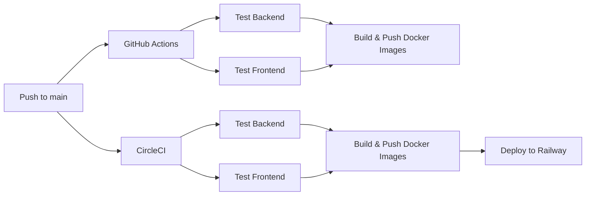

# 🚀 CI/CD Pipeline

Automated testing, building, and deployment pipeline for Smart Learning Companion.

**Live Deployment**: https://frontend-production-926f.up.railway.app

---

## Overview

The project uses **two CI/CD systems** running in parallel:



---

## GitHub Actions

**Config**: [`.github/workflows/ci-cd.yml`](../.github/workflows/ci-cd.yml)

### Pipeline Stages

| Stage | Trigger | Description |
|-------|---------|-------------|
| **Test Backend** | Push / PR to `main`, `develop` | Install Python 3.11, run `pytest` |
| **Test Frontend** | Push / PR to `main`, `develop` | Install Node.js 20, run lint & build |
| **Build & Push** | Push to `main` only | Build multi-stage Docker images, push to Docker Hub |

### Required GitHub Secrets

| Secret | Description |
|--------|-------------|
| `DOCKER_USERNAME` | Docker Hub username |
| `DOCKER_PASSWORD` | Docker Hub password or access token |

### Docker Image Tags

Images are pushed with automatic tagging:
- `latest` — always points to the latest `main` build
- `main-<sha>` — commit-specific tag
- `main` — branch tag

> [!NOTE]
> The deployment job in GitHub Actions is currently **commented out**. Deployment is handled by CircleCI (see below).

---

## CircleCI

**Config**: [`.circleci/config.yml`](../.circleci/config.yml)

### Pipeline Stages

| Stage | Trigger | Description |
|-------|---------|-------------|
| **Test Backend** | All pushes | Python 3.11, install deps, run `pytest` |
| **Test Frontend** | All pushes | Node.js 20, `npm ci`, lint, build, test |
| **Build Backend Image** | `main` branch only | Build & push backend Docker image |
| **Build Frontend Image** | `main` branch only | Build & push frontend Docker image |
| **Deploy to Railway** | `main` branch, after builds | Redeploy services on Railway |

### Required CircleCI Environment Variables

| Variable | Description |
|----------|-------------|
| `DOCKER_USERNAME` | Docker Hub username |
| `DOCKER_PASSWORD` | Docker Hub password or access token |
| `RAILWAY_TOKEN` | Railway API token for deployment |

### Deployment

CircleCI deploys to **Railway** by triggering a redeploy of each service:

```bash
railway redeploy --service backend --yes
railway redeploy --service frontend --yes
railway redeploy --service chromadb --yes
```

Railway pulls the latest Docker images from Docker Hub that were built in the previous stage.

---

## Railway Deployment

The application is hosted on [Railway](https://railway.app) with the following services:

| Service | Description |
|---------|-------------|
| **Frontend** | Next.js app served via Docker |
| **Backend** | FastAPI server via Docker |
| **ChromaDB** | Vector database for RAG |
| **PostgreSQL** | Relational database (Railway managed) |

### Live URLs

- **App**: https://frontend-production-926f.up.railway.app

---

## Setup Guide

### 1. GitHub Actions

Already configured via `.github/workflows/ci-cd.yml`. Just add the required secrets:

1. Go to **Settings → Secrets and variables → Actions**
2. Add `DOCKER_USERNAME` and `DOCKER_PASSWORD`

### 2. CircleCI

1. Connect your GitHub repository to [CircleCI](https://circleci.com)
2. Go to **Project Settings → Environment Variables**
3. Add `DOCKER_USERNAME`, `DOCKER_PASSWORD`, and `RAILWAY_TOKEN`

### 3. Railway

1. Create a project on [Railway](https://railway.app)
2. Add services for Backend, Frontend, ChromaDB, and PostgreSQL
3. Configure environment variables for each service
4. Generate a `RAILWAY_TOKEN` and add it to CircleCI
